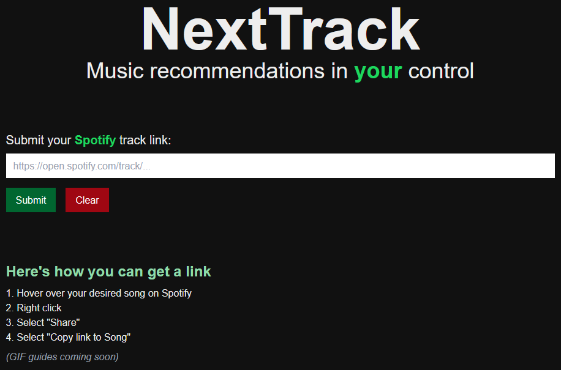
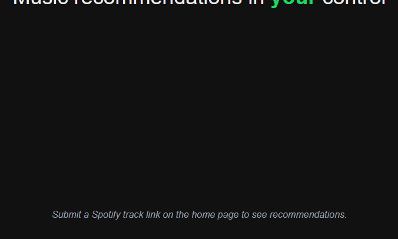
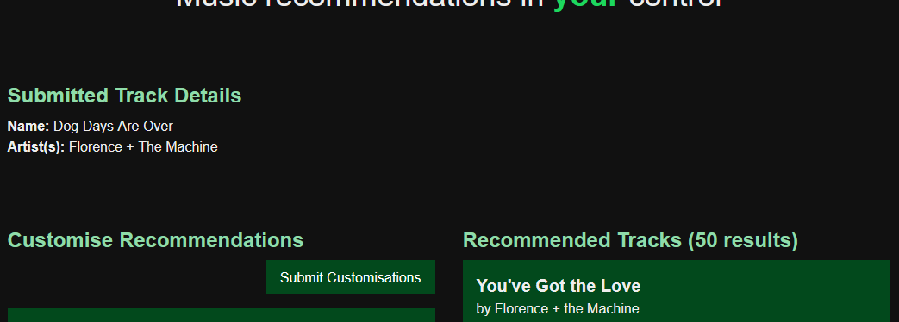
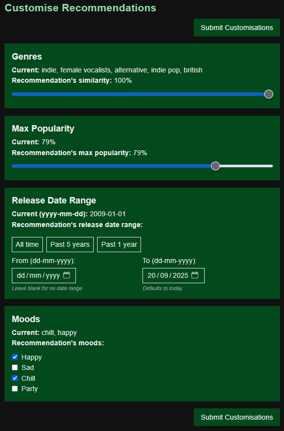
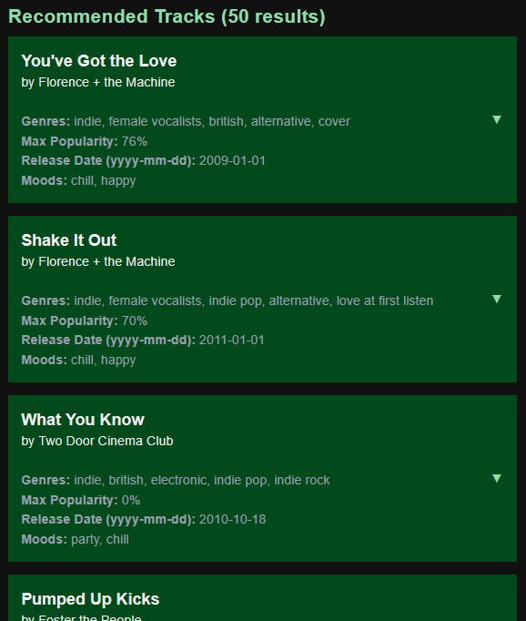
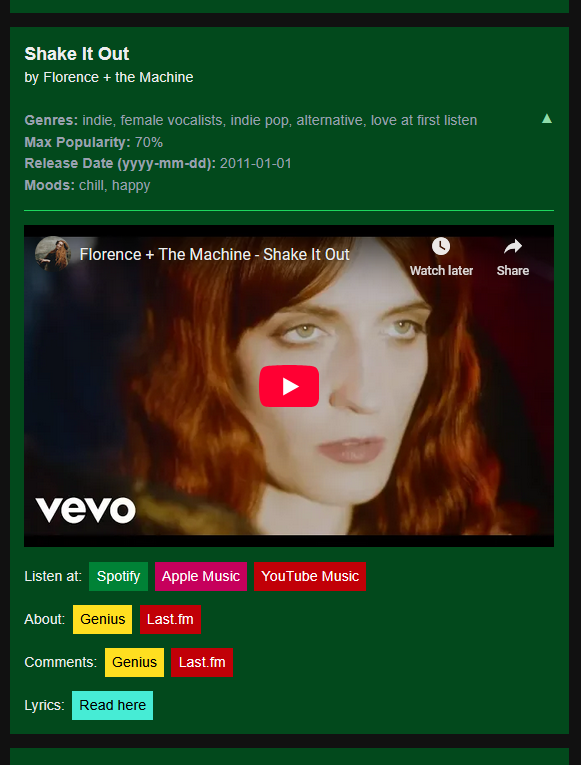
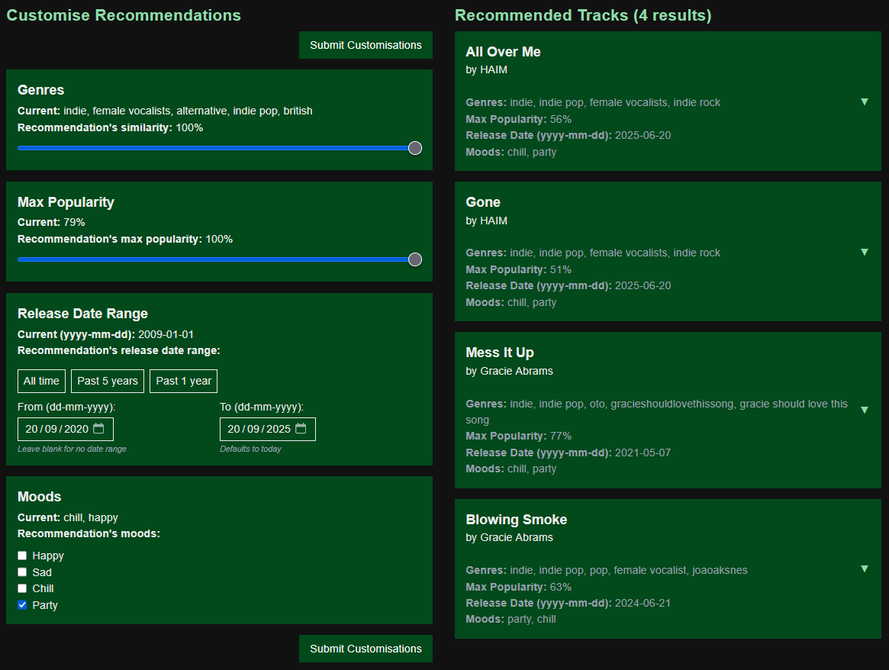

-   [Introduction](#introduction)
-   [Getting Started](#getting-started)
-   [Preview](#preview)
-   [Notes For Myself](#notes-for-myself)
    -   [About Files](#about-files)
    -   [App's Flow](#apps-flow)
    -   [WIP - All TODOs](#wip---all-todos)

# Introduction

> [!note]
> This is a [Next.js](https://nextjs.org) project bootstrapped with [`create-next-app`](https://nextjs.org/docs/app/api-reference/cli/create-next-app).

NextTrack is a music recommendation application (app) that uses:

-   [Spotify Web API](https://developer.spotify.com/documentation/web-api)
-   [Spotify Web API (NPM version)](https://www.npmjs.com/package/spotify-web-api-node)
-   [Last.fm API](https://www.last.fm/api)
-   [Last.fm web scraping](https://www.last.fm/home)
-   [Genius API](https://docs.genius.com/)
-   [Genius web scraping](https://genius.com)

...to dynamically generate recommended tracks.

How it works:

1. User submits a Spotify track's link (URL).
2. NextTrack retrieves that track's data (e.g. artist name, track name, release date).
3. NextTrack converts that data into parameters (e.g. max popularity, release data range, mood).
4. User adjusts parameters to get different recommended tracks.

> [!tip]
> No signing up or logging in is required. Simply copy-paste a Spotify track's link.

# Getting Started

Visit [https://fyp-nexttrack.vercel.app/](https://fyp-nexttrack.vercel.app/), or...

1. [Clone](https://docs.github.com/en/repositories/creating-and-managing-repositories/cloning-a-repository) this repository into local machine.

2. Ensure there is a `.env` file placed at `./src` with the following variables:

    `./src/.env:`

    ```txt
    SPOTIFY_CLIENT_ID
    SPOTIFY_CLIENT_SECRET

    LASTFM_API_KEY
    LASTFM_SECRET

    GENIUS_CLIENT_ID
    GENIUS_CLIENT_SECRET
    GENIUS_CLIENT_ACCESS_TOKEN
    ```

3. Open terminal to this project's directory at `./`.

4. In terminal, run the following commands:

    - Install packages (TODO ignore any vulnerabilities that may appear):

    ```bash
    npm i
    ```

    - Start development server:

    ```bash
    npm run dev
    # or
    yarn dev
    # or
    pnpm dev
    # or
    bun dev
    ```

5. Access [http://localhost:3000](http://localhost:3000) on browser to visit app.

    - As files (e.g. `./src/app/page.tsx`) get edited and saved, its corresponding pages are auto-updated.

# Preview

Home page: \


Recommendations page (without submitting a track): \


Recommendations page (proper): \


Recommendations page's "Customise Recommendations" section: \


Recommendations page's "Recommended Tracks" section: \


Recommendations page's recommended track: \


Demonstration of dynamically-generated recommended tracks:

-   Genre similarity: `100%`
-   Max popularity: `100%`
-   Release date range: `past 5 years`
-   Mood: `party`



# Notes For Myself

_Just some notes for myself that could be useful for you too._

## About Files

-   Files at root directory (`./`) may be ignored (e.g. those with "config" in their names).

    -   They were auto-generated by Next.js.

-   App's source code is found at `./src`.

## App's Flow

Upon starting app (i.e. accessing home page):

1. `./src/app/page.tsx`

Upon manually adding "/recommendation" in URL:

1. `./src/app/page.tsx`
2. `./src/app/recommendations/page.tsx`

Upon submitting a Spotify track link:

1. `./src/app/page.tsx`
2. `./src/app/api/recommendations/route.ts`
3. `./src/app/recommendations/[spotifyTrackId]/page.tsx`

Upon submitting customisation parameters:

1. `./src/app/recommendations/[spotifyTrackId]/page.tsx`
2. `./src/app/recommendations/[spotifyTrackId]/page.tsx` but with "?{param}={value}" in URL

## WIP - All TODOs

-   [./src/app/api/recommendations/route.ts](./src/app/api/recommendations/route.ts)

-   [./src/app/recommendations/[spotifyTrackId]/page.tsx](./src/app/recommendations/[spotifyTrackId]/page.tsx) has FIXME
-   [./src/app/recommendations/[spotifyTrackId]/page.client.tsx](./src/app/recommendations/[spotifyTrackId]/page.client.tsx)

-   [./src/ui/components/recommendations/CustomiseRecommendations/index.tsx](./src/ui/components/recommendations/CustomiseRecommendations/index.tsx)

-   [./src/libs/api/lastfm.ts](./src/libs/api/lastfm.ts)
-   [./src/libs/api/genius.ts](./src/libs/api/genius.ts)
